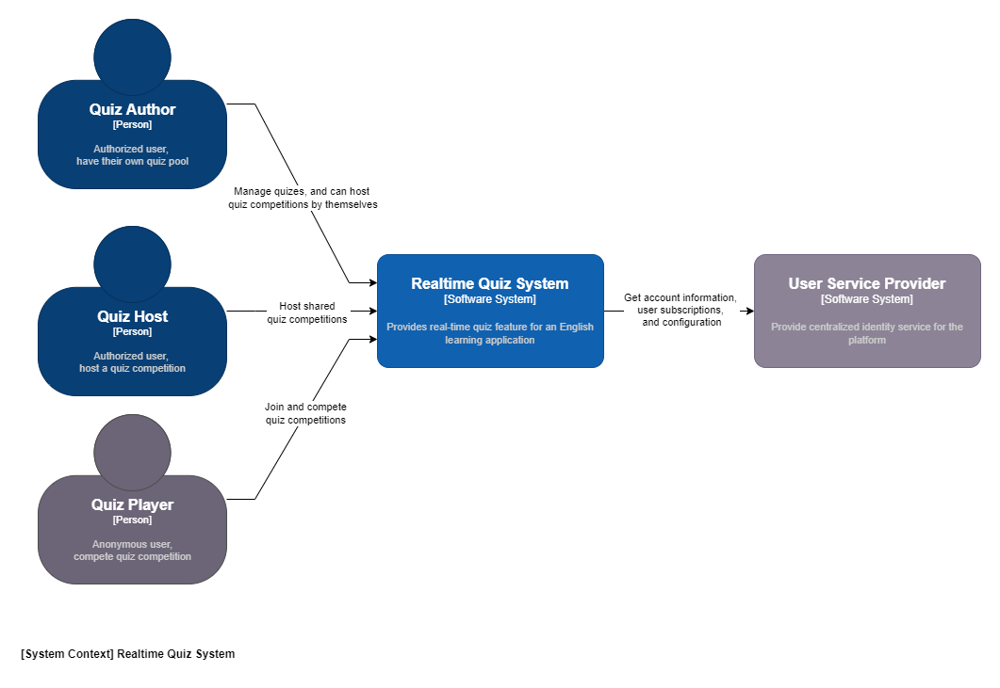
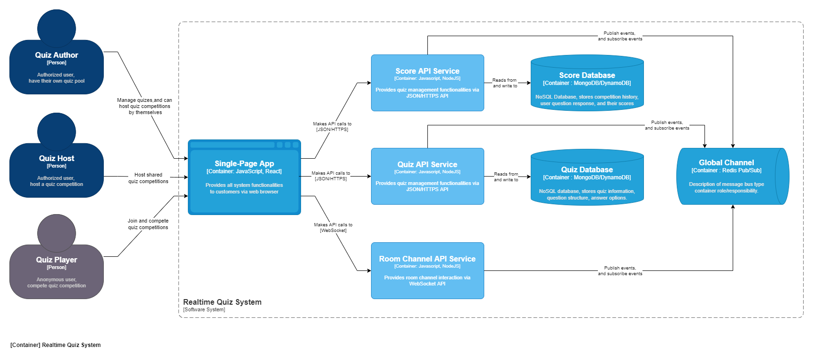
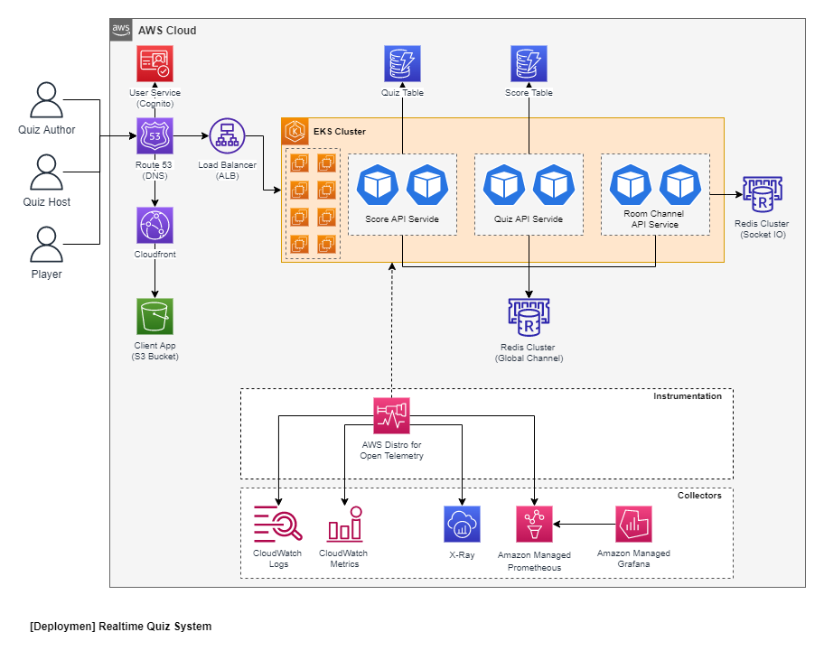
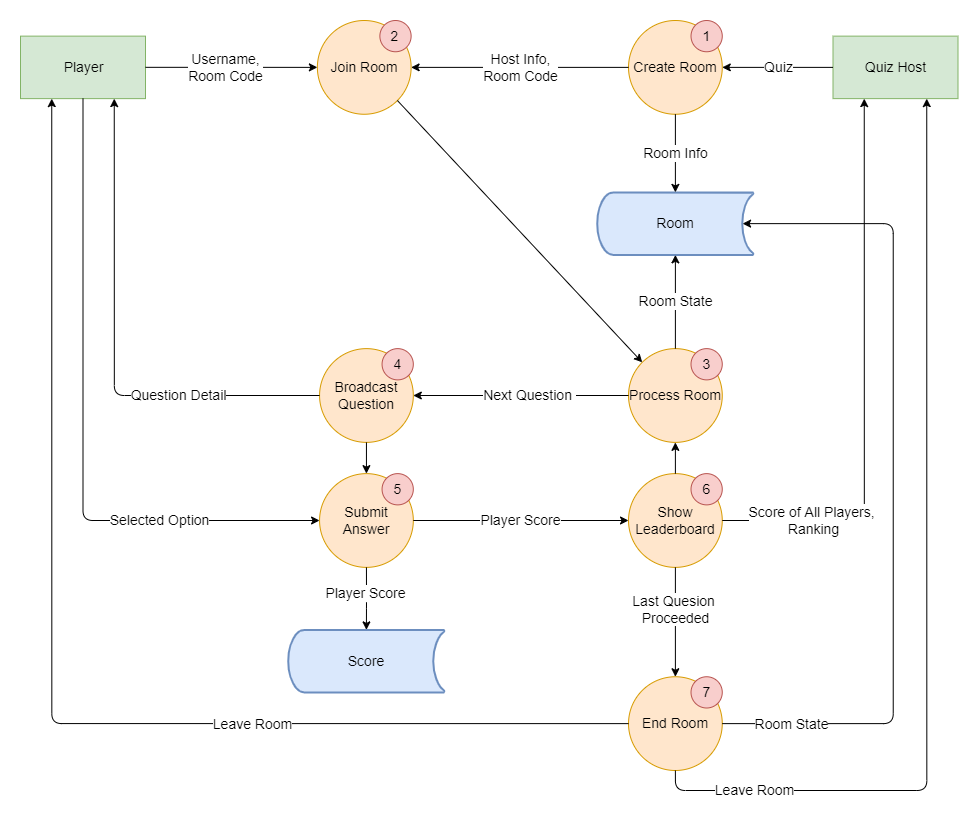

# Real-Time Quiz System Design

The architecture design is visualized using **C4 Model** approach. This document will contain:
- [System Context Diagram](#system-context)
- [Containers Diagram](#containers)
- [Deployment Diagram](#deployment)
- [Data Flow Diagrams](#data-flow)

## System Context

There would be ***3 main actors*** will use the system including:
- **Quiz Author**: an authorized user in the system, who has capabilities to manage quiz content and question structure. He/she can also act as a Quiz Host to host rooms for competition.
- **Quiz Host**: an authorized user in the system, who can host rooms for competition for the quizes he/she had been granted permission to access.
- **Quiz Player**: an anonymous user that take part in competition based on the information provided by the host user. They can even register their account to have access to competition history feature.

The **User Service Provider** is considered as ***external service*** since we may want to centralize the account management and user configuration. So, these information can be granted access to other platforms/sub systems in the learning eco system such as E-Learning Management System, Class Management System, etc.

## Containers

The system will be decomposed into ***7 main containers***:
- **Single-Page App**: a unified client application that will provide all system functionalities to users via web browsers including: quiz management, quiz hosting, quiz competition (room), etc. We can use `React/Vue/Angular` to build this container. There are 3 main interfaces we may want to build up: 
    - *Quiz Management Dashboard*: set of layout support for quiz management including: create, update, publish, and competition history.
    - *Quiz Host Views*: set of layout for quiz hosts to create, control quiz room progress.
    - *Quiz Participant Views*: set of layout for players to join, response to questions.
- **Score API Service**: a REST API service built on `NodeJS (Express)` to expose the competition and score endpoints. It can be implemented in any other languages or web api frameworks, but `NodeJS (Express)` is a great option for it popularation and huge community.
- **Score Database**: The database to store the competition information such as room info, the used quiz, participant scores for leaderboard. It is recommended to use NoSQL DB engine such as `MongoDB` or `AWS DynamoDB (prefered)` to store these data. There are 2 main reasons:
    - We need the flexible data structure which we can add more properties for competition enhancement or support new competition type.
    - The platform needs to achieve a high read/write operation for the realtime response while querying the data. So, NoSQL is a great option for this combination.
- **Quiz API Service**: a REST API service built on `NodeJS (Express)` to expose the quiz endpoints.
- **Quiz Database**: The database to store the quiz content and question structure. It is also recommended to use NoSQL DB engine such as `Mongo DB` or `AWS DynamoDB` to store the data:
    - The quiz information is quite lightweight and we will need the flexibility in question types for future enhancement.
    - The database needs to be the separated one from the *Score Database* since there are difference access frequencies between them and we may want to keep the services isolated from the others.
- **Room Channel API Service**: the Socket API service built on `NodeJS` and `Socket.io` to group participants into room channels and broadcasting room progress events to relavant socket clients. There will be an internal Redis Pub/Sub (different from *Global Channel*) to help scale out the socket instances.
- **Global Channel**: the global centralized pub/sub channels to handle events accross components such as `playerAnswerSubmitted`, `roomEnded`, `roomProceeded`, `questionPublished`, etc. Other services will subscribe the relevant channels to have further execution based on the event type and data. The `Redis Pub/Sub` is recommended over `Kafka`:
    - The event size is not large and there is no need to store any copies of events that had been sent during quiz competition.
    - Speed is an important factor, Redis sends the messages to the consumers all at once immediately and later the message is removed. While with Kafka the consumers have to pull instead.
    - Scaling out Redis using simpler, we can also have clusters with different node size to support various subscription types.

## Deployment
The system deployment will use AWS Cloud Provider and it's relevant services.

### Scallability
- The **Single-Page App** will be built and push to `S3 bucket` front with a `Cloudfront Distribution` to serve as a static web application.
- For **Score API Service**, **Quiz API Service**, and **Room Channel API Service**:
    - The services will be deployed as containers to the `EKS Cluster`. There are some reasons we use `EKS` instead of `Lambda Function` (as we normally see in many guides and aws referenced architects):
        - `Lambda` can be good with auto scalability but it has max quotas up to 10k concurrent executions per AWS accounts shared accross all functions.
        - We also may want to implement `silo model` where we can serve larger corperation users in a dedicated environment with separated services, storage and infrastructure. Using `Lambda` may add the complexity to the operation where multiple AWS accounts come into play. In constrast, using `EKS` can help to achieve this as we only need to replicate the cluster and the relevant storage components (`DynamoDB`, `Redis Cluster`).
    - The services will be fronted with the `Application Load Balancer (ALB)` with `Sticky Sessions` enabled:
        - This is required to scale out the **Room Channel API Service**, a `Redis Cluster (Elasticache)` will also be needed.
        - A custom header implementation can be implemented by placing the `CloudFront Distribution` in front of the `ALB` to add the security (ALB access can be restricted to custom header) and help to direct the user to relevant downstream services. For example, the user with premium subscription, should be able to access the services launched in better infrastucture resources and can host competition (room) that supports larger player pool.
- The `DynamoDB` will be created for **Quiz Database** and **Score Database**.

### Monitoring and Observability
- We can setup `AWS Distro for Open Telemetry` using EKS Add-ons. Then we can setup:
    - `Container Logs Collector` to send the log from our containers to the `CloudWatch Logs`.
    - `Promethes Metrics Collector` to send the metrics to `Amazon Managed Prometheous` and using `Amazon Managed Grafana` with Prometheous datasource setup to visualize the metrics dashboard.
    - `AWS X-Ray Exporter` to send X-Ray format traces to `AWS X-Ray`. 
    - Other exporters for 3rd party tools such as `Datadog`, `New Relic` or `Splunk`.

## Data Flow
- The bellow data flow diagram illustrates how data flows from when a user joins a quiz to when the leaderboard is updated.
